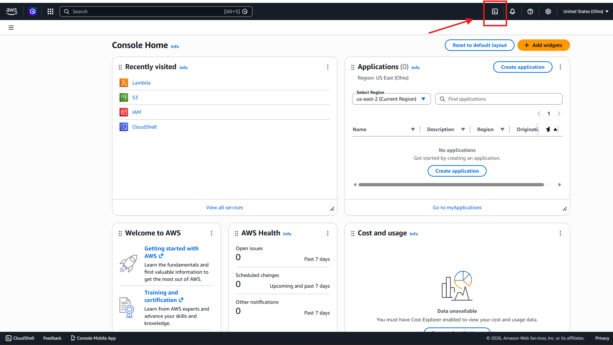
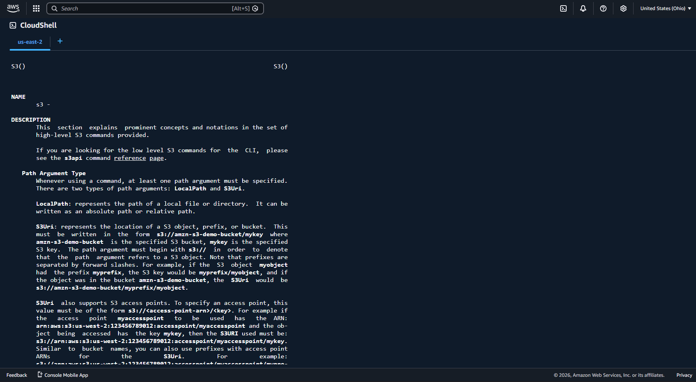
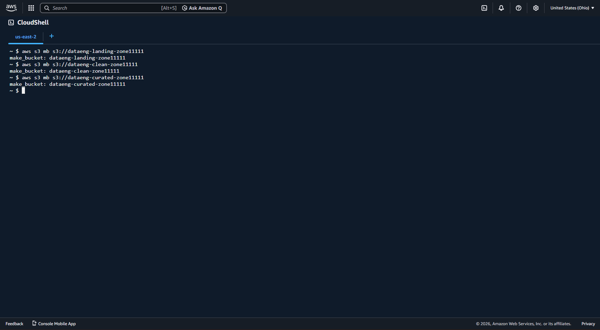

<h1 align="center"> Createing Amazon S3 buckets using AWS CloudShell.</h1>
 

<h3 align="left">Step 1: login to your AWS Console and click on CloudShell icon</h3>

  

<h3 align="left">Step 2: type "aws s3 help" to learn about service</h3>

  

<h3 align="left">Step 3: run the following 3 commands in the CloudShell to create your buckets (bucket names must be unique)</h3>

  

