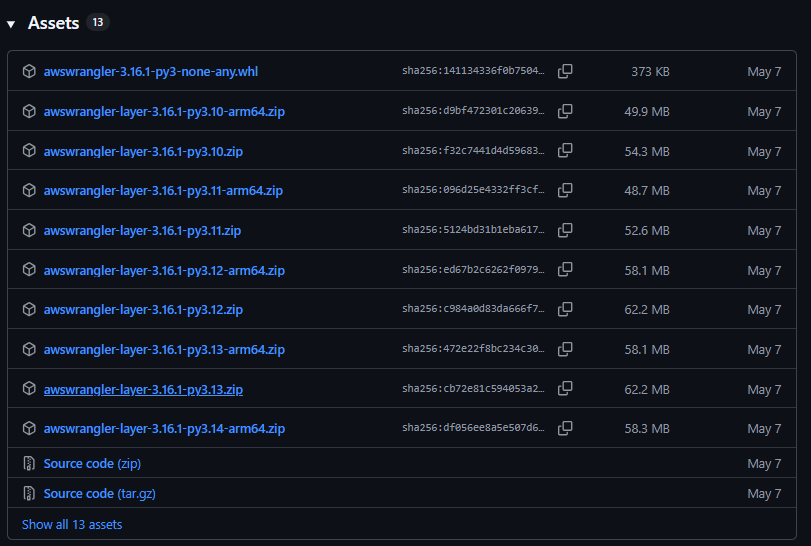
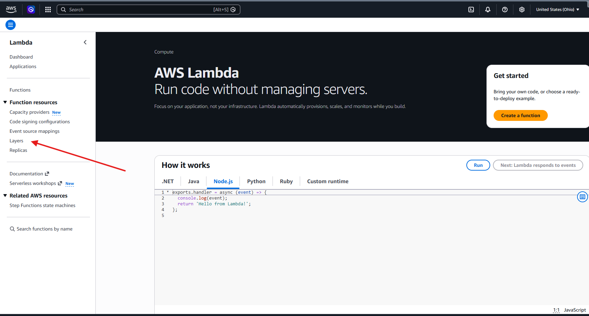
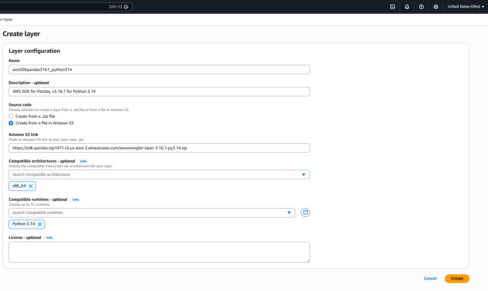
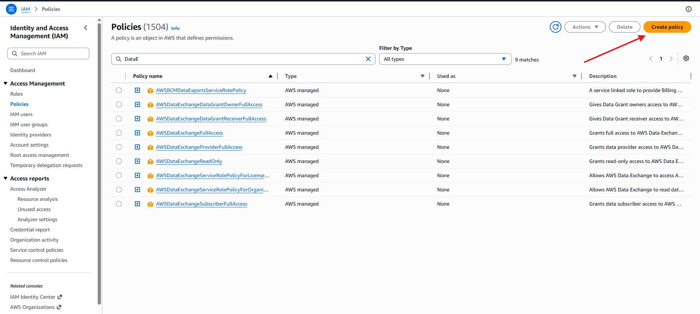
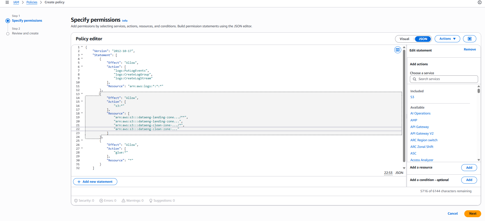
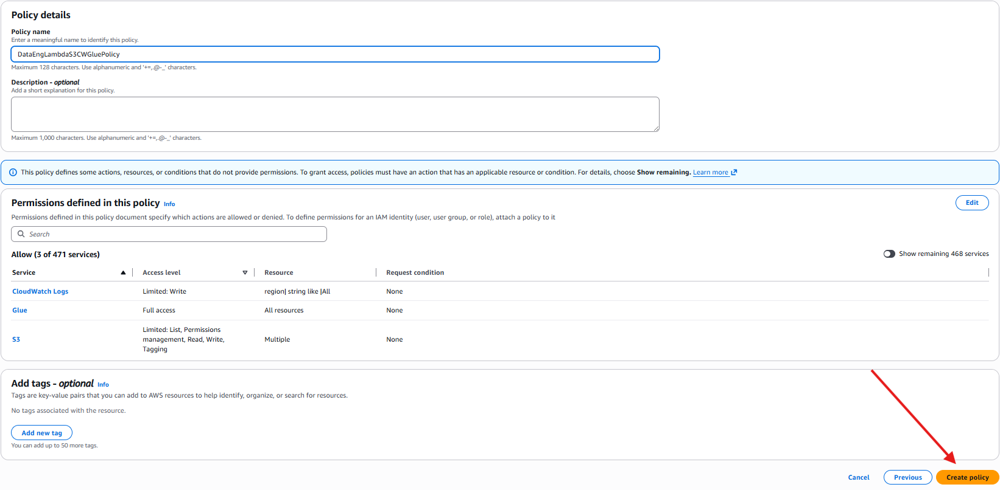
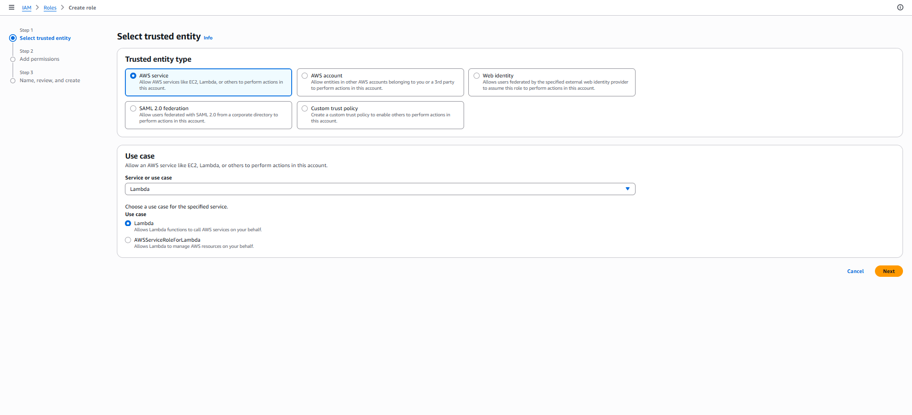
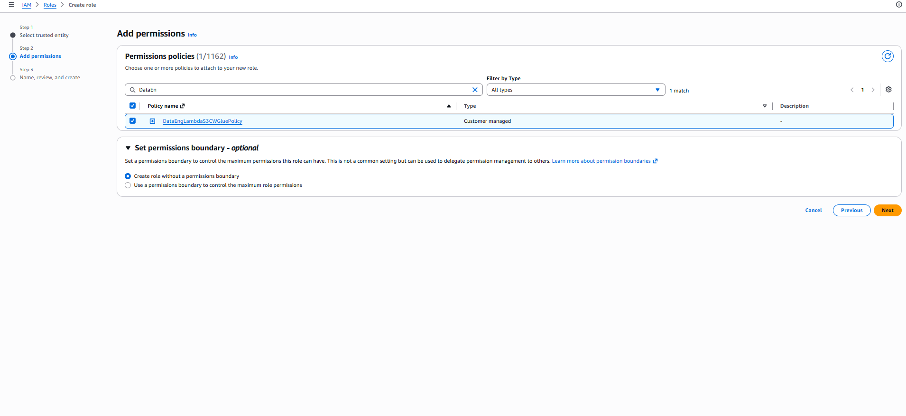

<h1 align="center">Triggering an AWS Lambda function when a new file arrives in an S3 bucket.</h1>

We're going to configure an S3 bucket to automatically trigger a lambda function whenever a new file is written to the bucket.

<h2>First we'll create a Lambda Layer that allows Lambda function to bring in additional code. In this example we will use  AWS SDK for Pandas Python Library.</h2>
<h3>To create Lambda Layer download awswrangler version 3.16.1 for python version 3.14 from https://github.com/aws/aws-sdk-pandas/releases </h3>

  

<h2>AWS Management Console -> S3 buckets -> Create new bucket -> Upload zip file for Pandas Library in S3 bucket</h2>
<h3>AWS Management Console -> Lambda function -> in the left-hand menu select Layer</h3>

  

<h3>Provide layer name -> Source Code: amazon s3 -> compatioble architecture must be compatible with the zip file downloaded -> Compatible Runtime also must be same as zip files version -> Create</h3>

  

<h2>Create IAM Policy and Role for Lambda function</h2>
<h3>AWS Management Console -> IAM service -> left-hand menu select Policies -> Create policy</h3>

  

<h3>Copy the JSON code from the json file attached in github: DataEngLambdaS3CWGluePolicy -> paste it on JSON Tab in Policy Editor -> Next</h3>

  

<h3>provide name for for the policy -> Create policy</h3>

  

<h2>Now lets create Role</h2>
<h3>IAM service -> in the left-hand meny select Roles -> Create Role -> ensure AWS service is selected -> for the service select Lambda -> Next</h3>

  

<h3>under Add Permissions -> select the policy we just created -> tick the policy box -> Next</h3>

  

