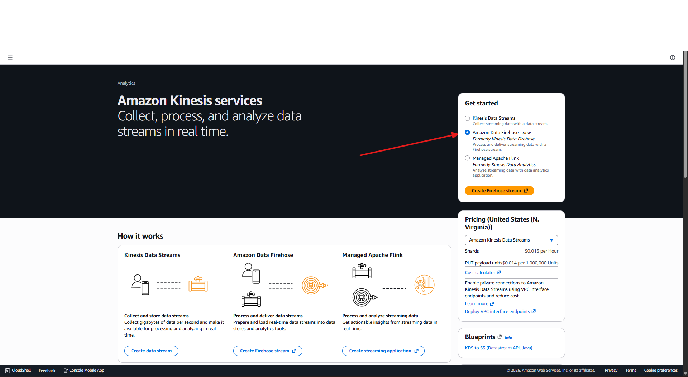
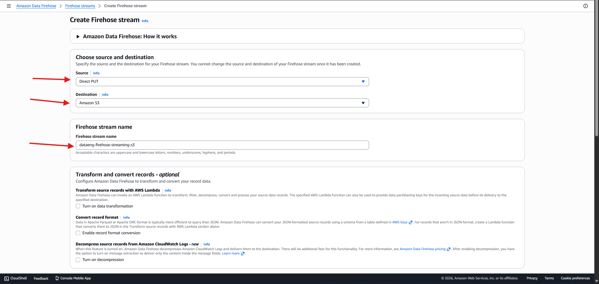
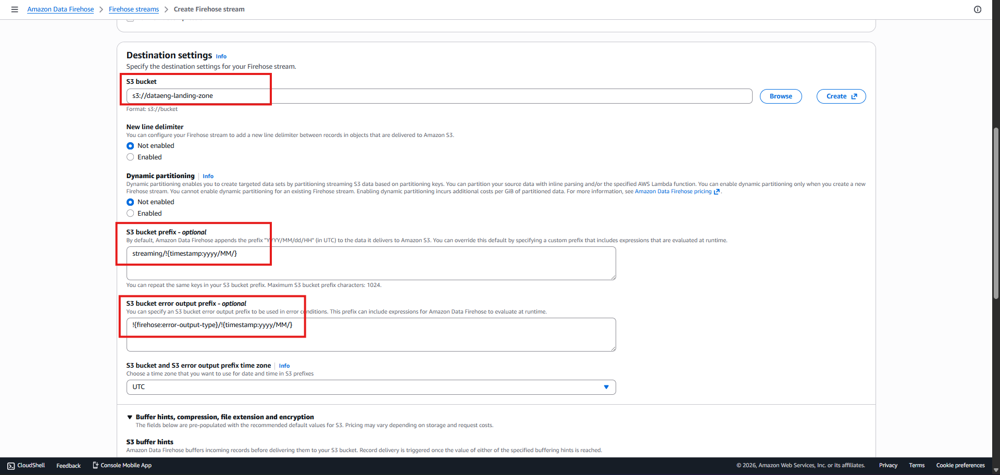
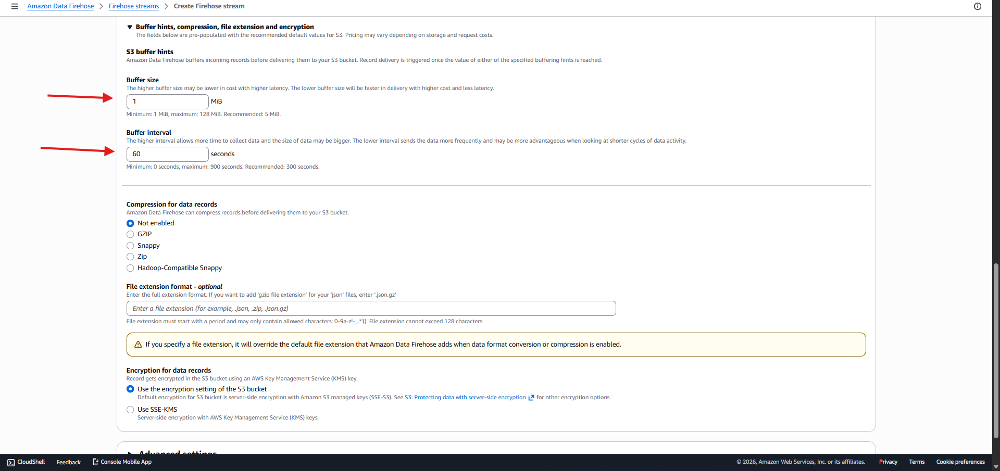

<h1 align="center">Streaming sample data to Amazon Kinesis with Amazon Kinesis Data Generator (KDG)</h1>
<h2>Configuring Kinesis Data Firehose for streaming delivery to Amazon S3</h2>
<h3>Kinesis service -> Amazon Data Firehose -> Create Firehose Stream</h3>

  

<h3>Source: Direct Put -> Destination: Amazon s3 -> provide Firehose stream name</h3>

  

<h3>Destination settings: select s3 bucket landing zone we created before -> provide prefix as pic for s3 bucket prefix and for s3 bucket error output prefix</h3>

  

<h3>Buffer size: 1MB -> Buffer interval -> 60sec -> leave other settings as default -> Create delivery stream</h3>

  

